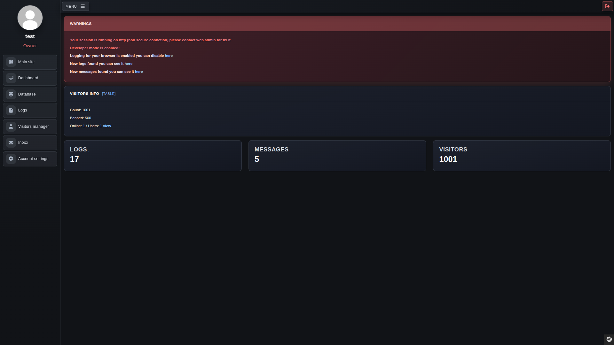

## Basic website template
This is a basic website template for creating websites with Symfony and Bootstrap.

## Preview
### Public page (contact form)

### Admin page (dashboard)

## Installation (with mysql/apache)
- install app [Requirements](#requirements)
- Clone the repository to your /www directory
- configure apache config like [apache-site.conf](./docker/configs/apache-site.conf)
- for production use only APP_ENV=prod! (in .env)
- configure app environment in .env.prod
- install dependencies `composer install && npm install && npm run build`
- create database `doctrine:database:create`
- migrate database structure `doctrine:migrations:migrate --no-interaction`
- install opcache (optional)

## Development environment
The complete stack for development is in Docker Compose, including PHP, Node, and Composer. You just need to run the docker-start script.

## Deployment
The new version is deployed automatically using GitHub Actions when a new release is created.

## Requirements
- Apache / Nginx PHP compatible web server
- PHP 8.5
- PHP-PDO_MYSQL
- PHP-INTL
- PHP-GD

## Dependencies
* Symfony
   * [Website](https://symfony.com/)   
* Bootstrap
   * [Website](https://getbootstrap.com/)
* Boxicons
   * [Website](https://boxicons.com/)
* Fontawesome
   * [Website](https://fontawesome.com)
* Apexcharts
   * [Github](https://github.com/apexcharts/apexcharts.js)
* PhpunitPrettyPrint
   * [Github](https://github.com/indentno/phpunit-pretty-print)

## License
This software is licensed under the [MIT license](LICENSE)
